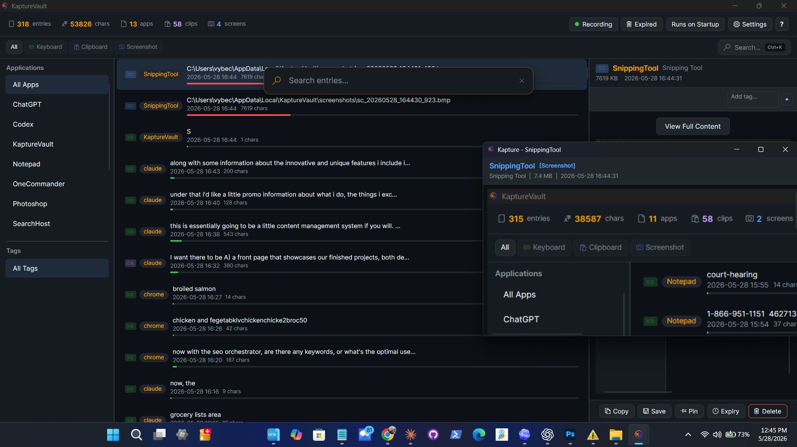
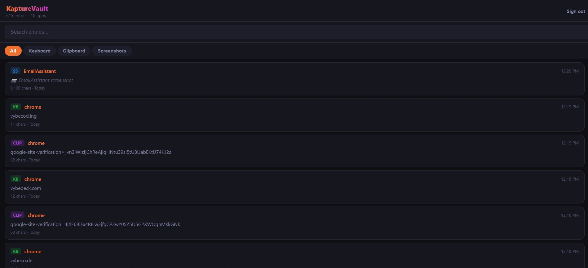

<div align="center">


# KaptureVault

### The clipboard manager, supercharged.

**Capture every keystroke, clipboard copy, and screenshot — searchable, taggable, and always at your fingertips.**
Local-first and private by default, with an optional end-to-end-encrypted cloud vault.

<br/>

[](https://github.com/Vybecode-LTD/KaptureVault/releases/latest)
[](https://github.com/Vybecode-LTD/KaptureVault/releases)
[](https://github.com/Vybecode-LTD/KaptureVault/releases/latest)
[](#-download)
[](#-built-with)
[](#-privacy--security)

<br/>

[](https://github.com/Vybecode-LTD/KaptureVault/releases/latest)
&nbsp;
[](https://kapture.tools/vault/)
&nbsp;
[](https://kapture.tools)

</div>

<br/>

<div align="center">
  
</div>

<br/>

## What it does

KaptureVault runs quietly in the system tray and records your **clipboard history**, **keystrokes** (per application), and **screenshots** into a fast, local SQLite vault — so you can find and recover anything you've typed or copied. Search it instantly, tag and pin what matters, annotate screenshots, and optionally encrypt the whole thing with a password only you hold. When you want it everywhere, turn on the **Online Vault** for end-to-end-encrypted sync and read it from any browser.

## ✨ Features

- **📋 Clipboard history** — every text, image, and file you copy, saved and searchable.
- **⌨️ Keyboard capture** — recover anything you've typed, organized by app.
- **📷 Screenshot capture** — automatic, timestamped, with a built-in **annotation editor** (pen, shapes, arrows, text, highlight).
- **🔍 Instant search** — find any entry in milliseconds; filter by app, type, or keyword.
- **🏷️ Tags, pinning & auto-expiry** — keep the important, auto-clean the rest.
- **🔒 AES-256-GCM encryption** — optional, password-protected; the key is derived locally (PBKDF2, 600k).
- **⚡ Quick-Paste hotkey** — `Ctrl+Shift+V` to paste from your vault anywhere.
- **☁️ Google Drive sync** — optional encrypted whole-vault backup.
- **🌐 Online Vault + web vault** — end-to-end-encrypted cloud sync (vault + screenshots) you can browse at [kapture.tools/vault](https://kapture.tools/vault/).
- **📁 File hosting & share links** *(Pro)* — host files in your account and share them with revocable public links.
- **✅ Signed installer** — code-signed so Windows trusts it on install.

## ⬇ Download

**[Download the latest signed installer →](https://github.com/Vybecode-LTD/KaptureVault/releases/latest)**

- Windows 10 / 11 (64-bit). No account required to use the core app.
- The installer is **code-signed** (Azure Trusted Signing) and **VirusTotal-scanned** on every release.
- Also available from **[kapture.tools](https://kapture.tools)**, which always points at the newest build.

## 💳 Plans

| | Free · no account | Free · registered | **Pro — $49/yr** |
|---|:--:|:--:|:--:|
| Capture · local vault · search · annotate · DB export · Drive sync | ✓ | ✓ | ✓ |
| Account (Google **or** email/password) | — | ✓ | ✓ |
| End-to-end-encrypted Online Vault sync + screenshots + web vault | — | ✓ (≤250 MB) | ✓ (~10 GB) |
| File hosting + private/public **share links** | — | — | ✓ |

The full capture app is **free forever** with no account. The Online Vault is free once you sign in; **Pro** adds paid file hosting. [Manage your account →](https://kapture.tools/account/)

## 🔐 Privacy & security

- **Local-first.** By default everything stays on your machine — no account, no telemetry.
- **You hold the key.** Encryption uses AES-256-GCM with a key derived from your password (PBKDF2-SHA256, 600k iterations); it's never escrowed.
- **The Online Vault is end-to-end encrypted.** Your vault and screenshots are encrypted on your device before upload — the server only ever stores ciphertext, and your vault password is the only key. (Your *account* password is deliberately separate and can never recover your vault.)
- **Runs as a standard user** (`asInvoker`) — no admin rights required.
- **Signed & scanned.** Every release is Authenticode-signed with **Azure Trusted Signing** and VirusTotal-scanned.

## 🌐 Your vault, anywhere

<div align="center">
  
</div>

Sign in and your encrypted vault + screenshots sync automatically. Open **[kapture.tools/vault](https://kapture.tools/vault/)** on any device, enter your vault password, and browse, search, and view everything — decrypted locally in your browser.

## 🛠 Built with

.NET 9 · C# 13 · [Avalonia 11](https://avaloniaui.net) (Fluent, compiled bindings) · CommunityToolkit.Mvvm · Microsoft.Data.Sqlite (WAL) · SkiaSharp · AvaloniaEdit · Serilog. Shipped as a single-file, self-contained `win-x64` build.

<details>
<summary><b>Build from source</b></summary>

```powershell
git clone https://github.com/Vybecode-LTD/KaptureVault.git
cd KaptureVault
dotnet build -c Debug
dotnet run

# Release single-file publish:
dotnet publish KaptureVault.csproj -c Release -r win-x64 --self-contained true `
  -p:PublishSingleFile=true -p:IncludeNativeLibrariesForSelfExtract=true -o publish/win-x64
```

Requires the .NET 9 SDK.
</details>

## 🔗 Links

[Website](https://kapture.tools) · [Download](https://github.com/Vybecode-LTD/KaptureVault/releases/latest) · [Web vault](https://kapture.tools/vault/) · [Account](https://kapture.tools/account/) · [Changelog](CHANGELOG.md) · [Privacy](https://kapture.tools/privacy.html) · [Terms](https://kapture.tools/terms.html)

---

<div align="center">
<sub>© 2026 <a href="https://vybeco.de">VybeCode Ltd</a>. KaptureVault is a product of VybeCode.</sub>
</div>
